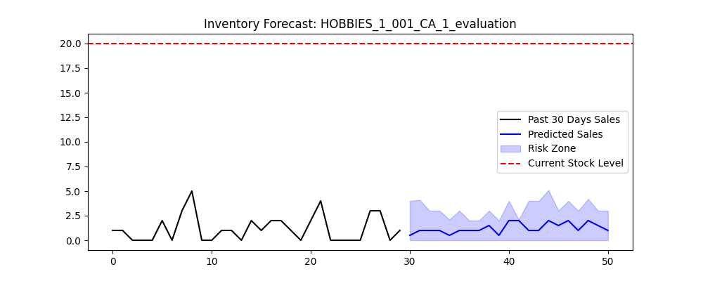

# 📦 AI-Powered Inventory Engine for Stock-Run Prediction

### 🚀 Strategic Overview
In retail supply chains, "Stock-Outs" (out-of-stock events) lead to millions in lost revenue. This project implements a **Transformer-based Forecasting Engine** using the **Amazon Chronos-2 Foundation Model** to predict future demand and automate reorder alerts for warehouse managers.

---

### 📊 Key Technical Features
* **Zero-Shot Forecasting:** Leveraged the **Chronos-T5-Base** model to perform probabilistic forecasting on the M5 Walmart dataset.
* **Safety Stock Optimization:** Implemented **P90 Quantile regression** logic to ensure 90% service level reliability.
* **Automated Decision Logic:** Created a "Reorder Point" (ROP) engine that calculates the intersection of current inventory and AI-predicted risk.
* **Interactive Dashboard:** Built a **Gradio-powered UI** for real-time inventory management.

---

### 🖼️ System Demo
Below is the AI engine's predictive capability and risk-zone calculation:

---

### 🛠️ Tech Stack
| Category | Tools |
| :--- | :--- |
| **Model** | Amazon Chronos-2 (Transformer-based) |
| **Language** | Python 3.x |
| **Libraries** | PyTorch, Pandas, NumPy, Matplotlib |
| **Deployment** | FastAPI, Gradio, Google Colab (T4 GPU) |

---

### 📈 Business Impact
By shifting from traditional methods to **Probabilistic AI Forecasting**, this engine:
1. Reduces manual inventory checks through **automated status alerts**.
2. Minimizes "Holding Costs" by optimizing reorder quantities.
3. Prevents lost sales by identifying **Demand Spikes** that simple statistics miss.

